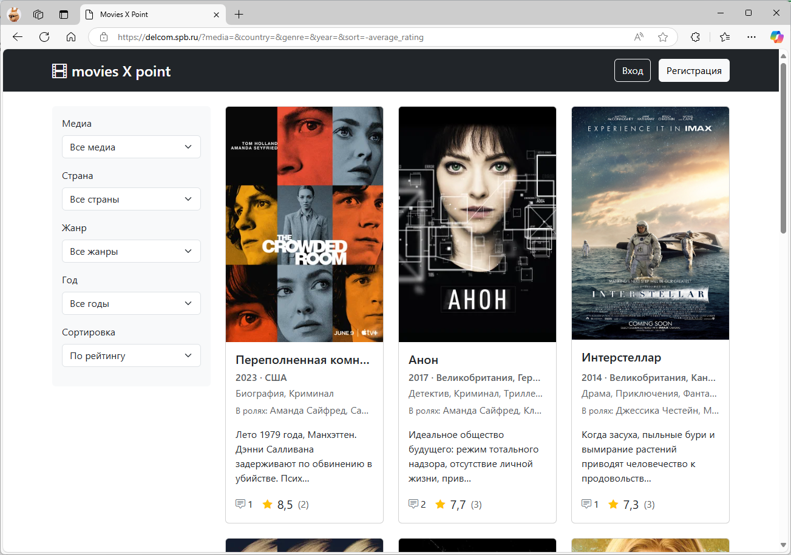
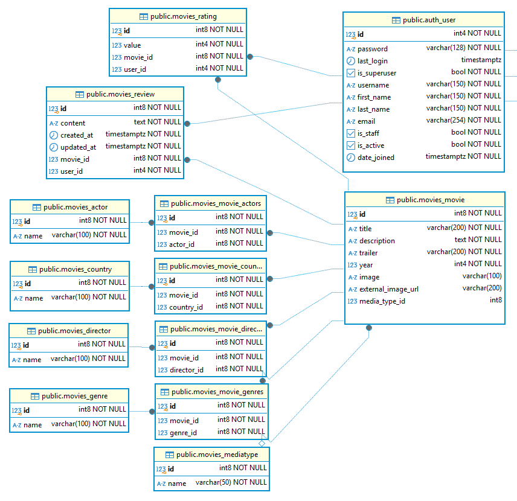
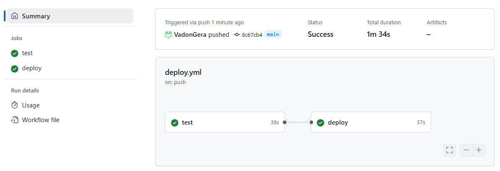

# movies X point
Добро пожаловать в проект **movies X point** ! 

https://www.delcom.spb.ru/

Проект создан с использованием Django и предназначен для 
предоставления пользователям возможности фильтрации и поиска фильмов, 
получения информации о них, оставления отзывов и выставления оценки фильму. 



## Стек технологий
- Backend: Python, Django
- Frontend: HTML, CSS, Bootstrap, JavaScript
- DevOps: Docker, Docker Compose, Nginx, Gunicorn, GitHub Actions
- Управление зависимостями: pip

## Установка и настройка

1. Клонирование репозитория: 


    git clone https://github.com/VadonGera/degree-work-movies.git name_project

2. Переменные окружения:
   * переименовать файл `.env.example` в `.env`;
   * установить переменные для базы данных `PGSQL_DB`, `PGSQL_USER`, `PGSQL_PASSWORD`;
   * установить переменные для суперпользователя;
   * `MODE_BOX`, по желанию можно использовать Gunicorn или manage.py Django
   * При необходимости можно изменить `PORT_BOX`

## Запуск

1. Запуск приложения на localhost:

   ```
   docker compose up --build
   
   http://127.0.0.1        # Приложение
   http://127.0.0.1/admin  # Админ-панель
   ```

2. Запуск приложения на домене с сертификатом Let’s Encrypt :
   
   * Скопировать данные сертификата в `/name_project/data`
   * Раскомментировать в `.env` переменные, относящиеся к `# for production`
   * Указать в `.env` и в `nginx.pro.conf` свой домен

   ```
   docker compose -f docker-compose.pro.yml up --build
   
   https://example.com        # Приложение
   https://example.com/admin  # Админ-панель
   
   ```

3. После развертывания приложения выполняются миграции и создание суперпользователя.

## База данных



1. Модели
   * User - базовая модель User Django
   * Movies - медиа
   * MediaType - тип медиа
   * Director - режисеры (ManyToManyField)
   * Actor - актеры (ManyToManyField)
   * Country - страны (ManyToManyField)
   * Genre - жанры (ManyToManyField)
   * Rating - рейтинг фильма
   * Review - рецензии

## Реализация

В проекте реализован следующий функционал:
   * Любой, не авторизированный пользователь может выполнять любые действия на сайте, кроме выставления оценок и написания рецензий.
   * Для авторизированного пользователя доступны выставление оценок, написание и редактирование своих рецензий. 
   * Вход по логину и паролю и выход.
   * Регистрация нового пользователя.
   * Фильтрация контента по нескольким характеристикам: `Тип медиа`, `Страны`, `Жанры`, `Годы производства`.
   * Сортировка контента `По названию` (по алфавиту), `По рейтингу` (по убыванию), `По дате выхода` (по убыванию).
   * Карточка фильма с полной информаций о фильме, включая все рецензии к фильму.
В карточке авторизированные 
пользователи могут поставить или изменить свою оценку и 
написать или изменить свою рецензию.
   * Средний рейтинг с указанием количества оценок пользователей.
   * При отсутствии изображения фильма в 
каталоге `/name_project/movies/src/media/movies/` приложение берет 
URL изображение из поля `external_image_url`. При отсутствии URL в поле выводится заглушка.
   * Логирование работы приложения (`logs/project.log`).
   * Логирование информации о входе и выходе пользователя (`logs/auth.log`)
   * Тестирование моделей.

## DevOps
#### Docker Compose
Веб-проект развертывается в Docker Compose с сервисами 
* `web` (само приложение), 
* `postgres`, 
* `nginx`, 
* `certbot`.

Для удобства дальнейшей разработки файлы приложения в контейнере монтируются к сервису `web`, а не копируются.
#### GitHub Actions
Механизм CI/CD реализован в `deploy.yml` 
* jobs `test` - создание среды для тестов, выполнение тестов
* jobs `deploy` - подключение к серверу, копирование репозитория на сервер, развертывание и запуск веб-проекта.


## План по доработке проекта
1. Поля name в моделях MediaType, Director, Actor, Country, Genre сделать уникальными.
2. Добавить для Director, Actor, Country, Genre поле status, чтобы, например, актеры выводились не в алфавитном порядке, а по значимости в фильме
3. Индексировать поля year, countries, genres, directors, actors в моделе Movies
4. Добавить фильтрацию по режисерам и актерам
5. Реализовать просмотр трейлеров (поле trailer)
6. Создание личного кабинета.
6. Реализовать функционал "буду смотреть"
6. Реализация REST API. Настройка аутентификации через JWT
